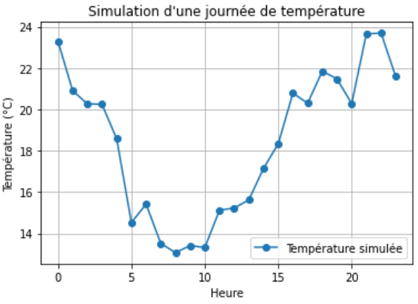

# Génération de données et simulations

Un autre atout de NumPy est sa capacité à **générer rapidement des données** (séquences, aléatoires, distributions).\
Cela est très pratique pour simuler des expériences ou créer de petits jeux de données de test.

## 1. Générer des suites numériques

```python
import numpy as np

print(np.arange(0, 10, 2))   # [0 2 4 6 8]
print(np.linspace(0, 1, 5))  # [0.   0.25 0.5  0.75 1.  ]
```

* `np.arange(debut, fin, pas)` → crée une suite avec un pas donné.
* `np.linspace(debut, fin, nb_points)` → crée une suite de `nb_points` répartis régulièrement.

***

## 2. Générer des valeurs aléatoires


```python
# Nombres aléatoires entre 0 et 1
print(np.random.rand(5))

# Entiers aléatoires entre 0 et 100
print(np.random.randint(0, 100, 5))

# Loi normale (moyenne 20, écart-type 3)
print(np.random.normal(loc=20, scale=3, size=10))
```

***

## 3. Générer des données structurées

#### Matrice de données aléatoires

```python
# Matrice 3x4 de nombres aléatoires uniformes [0,1)
M = np.random.rand(3, 4)
print(M)
```

#### Valeurs aléatoires entières pour une simulation

```python
# Simulation de la consommation de 7 bâtiments sur une semaine (kWh/jour)
conso = np.random.randint(80, 200, size=(7, 7))
print(conso)
```

## 4. Simulation avec NumPy

Exemple en **énergie** : on simule la consommation électrique d’un bâtiment pendant un mois (30 jours).\
On suppose que la consommation journalière suit une **loi normale** de moyenne `150 kWh` et d’écart-type `20 kWh`.

```python
# Simulation sur 30 jours
np.random.seed(0)  # pour avoir toujours les mêmes résultats
conso = np.random.normal(loc=150, scale=20, size=30)

print("Consommations simulées :")
print(conso[:10])  # on affiche les 10 premiers jours
print("Moyenne :", conso.mean())
print("Écart-type :", conso.std())
```

***

## 5. Cumul des données

On peut simuler la **consommation cumulée** au fil du temps avec `np.cumsum` :

```python
conso_cumulee = np.cumsum(conso)
print(conso_cumulee[:10])
```

Résultat (exemple) :

```
[138.9 288.5 426.9 606.5 778.0 786.6 925.7 1066.6 1218.0 1364.0 ...]
```

***

## 6. Exemple concret : simulation de température

Imaginons que nous voulons simuler la température horaire d’une journée de printemps.\
On suppose une température moyenne de **18°C** avec des variations journalières en forme de sinus et un bruit aléatoire.

```python
import numpy as np
import matplotlib.pyplot as plt

np.random.seed(0)

heures = np.arange(0, 24)
# Variation sinusoïdale (max à 15h, min à 3h du matin)
temp_base = 18 + 5 * np.sin((heures - 15) * np.pi / 12)

# Ajout d’un bruit aléatoire
bruit = np.random.normal(0, 1, size=24)
temp_simulee = temp_base + bruit

plt.plot(heures, temp_simulee, marker="o", label="Température simulée")
plt.xlabel("Heure")
plt.ylabel("Température (°C)")
plt.title("Simulation d'une journée de température")
plt.legend()
plt.grid(True)
plt.savefig("simulation_temperature.png", dpi=150, bbox_inches="tight")
```

<figure><figcaption></figcaption></figure>

## 👉 **À retenir**

* `arange` et `linspace` créent rapidement des suites numériques.
* `np.random` permet de **simuler du hasard** (uniforme, gaussien, etc.).
* `np.cumsum`, `np.cumprod`, etc. servent à suivre des évolutions cumulées.
* NumPy est idéal pour générer des **données de test** avant de passer à Pandas ou à la visualisation.

***

_<mark style="color:$info;">Auteur :</mark>_ [_<mark style="color:$info;">Mateusz Bogdan</mark>_](https://matbog.github.io/)\
&#xNAN;_<mark style="color:$info;">Contenu texte et illustrations :</mark>_ [_<mark style="color:$info;">CC BY 4.0</mark>_](https://creativecommons.org/licenses/by/4.0/)\
&#xNAN;_<mark style="color:$info;">Exemples de code :</mark>_ [_<mark style="color:$info;">MIT License</mark>_](https://opensource.org/licenses/MIT)
