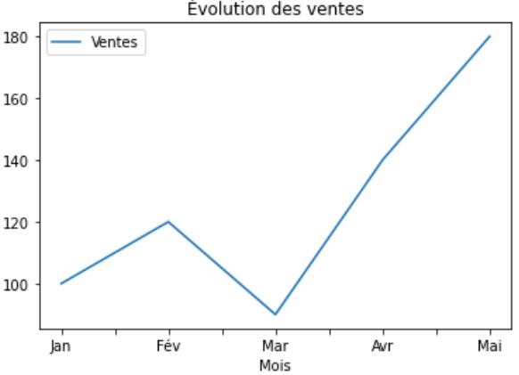

# Visualiser les données d'un dataframe

Pandas intègre une fonction de visualisation simple : **`DataFrame.plot()`**.\
Elle permet de tracer directement vos données (basée sur Matplotlib).

C’est très pratique pour explorer rapidement un jeu de données.

***

## 1. Exemple de base

```python
import pandas as pd

data = {
    "Mois": ["Jan", "Fév", "Mar", "Avr", "Mai"],
    "Ventes": [100, 120, 90, 140, 180]
}

df = pd.DataFrame(data)

# Tracer une courbe
df.plot(x="Mois", y="Ventes", kind="line", title="Évolution des ventes")
```

<figure><figcaption></figcaption></figure>


## 2. Types de graphiques disponibles

L’argument `kind` permet de choisir le type de graphique :

<table data-header-hidden><thead><tr><th width="185"></th><th></th><th></th></tr></thead><tbody><tr><td>Type (<code>kind</code>)</td><td>Description</td><td>Exemple</td></tr><tr><td><code>"line"</code></td><td>Courbe (par défaut)</td><td><code>df.plot(kind="line")</code></td></tr><tr><td><code>"bar"</code></td><td>Histogramme vertical</td><td><code>df.plot(kind="bar")</code></td></tr><tr><td><code>"barh"</code></td><td>Histogramme horizontal</td><td><code>df.plot(kind="barh")</code></td></tr><tr><td><code>"hist"</code></td><td>Histogramme de fréquences</td><td><code>df.plot(kind="hist")</code></td></tr><tr><td><code>"box"</code></td><td>Boîte à moustaches</td><td><code>df.plot(kind="box")</code></td></tr><tr><td><code>"area"</code></td><td>Graphique en aires</td><td><code>df.plot(kind="area")</code></td></tr><tr><td><code>"pie"</code></td><td>Camembert (sur une Series)</td><td><code>df["Ventes"].plot(kind="pie")</code></td></tr><tr><td><code>"scatter"</code></td><td>Nuage de points (nécessite <code>x</code> et <code>y</code>)</td><td><code>df.plot(x="col1", y="col2", kind="scatter")</code></td></tr></tbody></table>

## 3. Exemple : barres

```python
data = {
    "Produit": ["A", "B", "C"],
    "Ventes": [150, 200, 100]
}
df = pd.DataFrame(data)

df.plot(x="Produit", y="Ventes", kind="bar", title="Ventes par produit")
```

<figure><figcaption></figcaption></figure>

## 4. Exemple : scatter plot

```python
data = {
    "Poids": [50, 60, 70, 80, 90],
    "Taille": [160, 165, 170, 175, 180]
}
df = pd.DataFrame(data)

df.plot(x="Poids", y="Taille", kind="scatter", title="Taille vs Poids")
```

<figure><figcaption></figcaption></figure>

## 5. Personnalisation rapide

La méthode `.plot()` renvoie un objet **Axes** de Matplotlib.\
On peut donc utiliser toutes les fonctions Matplotlib pour personnaliser le graphique (titres, labels, couleurs…).

#### Exemple

```python
import pandas as pd

data = {
    "Mois": ["Jan", "Fév", "Mar", "Avr", "Mai"],
    "Ventes": [100, 120, 90, 140, 180]
}
df = pd.DataFrame(data)

# Création du graphique
ax = df.plot(x="Mois", y="Ventes", kind="line", color="red", marker="o")

# Personnalisation avec Matplotlib
ax.set_xlabel("Mois")                 # label axe X
ax.set_ylabel("Ventes (en €)")        # label axe Y
ax.set_title("Évolution des ventes")  # titre
ax.grid(True)                         # grille
```

<figure><figcaption></figcaption></figure>

👉 Grâce à cette approche, on combine la **simplicité de Pandas** avec la **puissance de Matplotlib** pour obtenir des graphiques clairs et personnalisés.

***

_<mark style="color:$info;">Auteur :</mark>_ [_<mark style="color:$info;">Mateusz Bogdan</mark>_](https://matbog.github.io/)\
&#xNAN;_<mark style="color:$info;">Contenu texte et illustrations :</mark>_ [_<mark style="color:$info;">CC BY 4.0</mark>_](https://creativecommons.org/licenses/by/4.0/)\
&#xNAN;_<mark style="color:$info;">Exemples de code :</mark>_ [_<mark style="color:$info;">MIT License</mark>_](https://opensource.org/licenses/MIT)
